# CheckersInScala

WELCOME TO CHECKERS!
-

How to win:
- The game ends if one player has less than 2 pieces or is unable to move with any of its pieces. 

Preparation:
- You are playing on a checkered board with the classic size 8 x 8 or the more comon size 10 x 10 
- One does use only the red fields
- Every player gets the first three rows on each side filled up with normal pieces on every red field

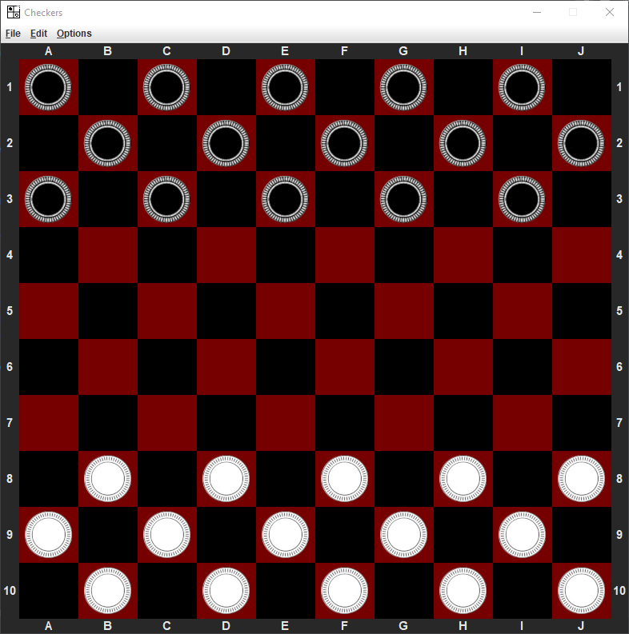 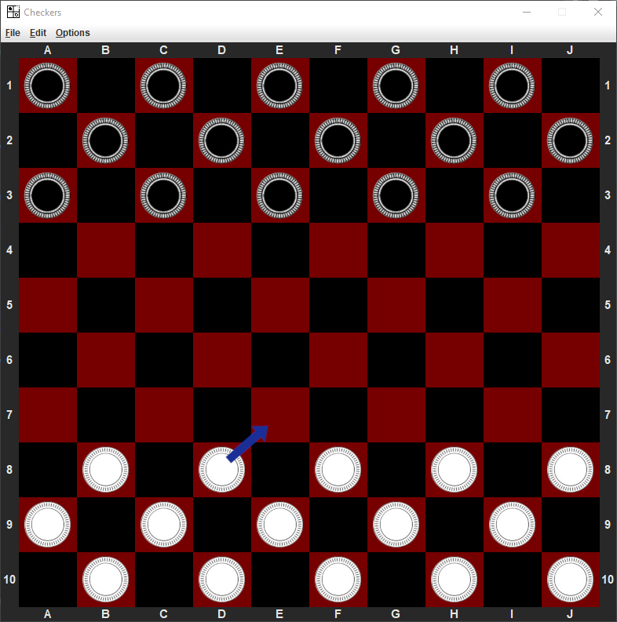 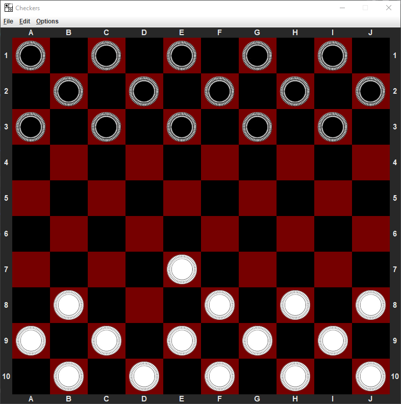
 

The moves:
- A normal piece can just move forward
- Is an enemys piece on the field right on the next diagonal field, and the next field afterwards is empty, you can capture the enemys piece by jumping over and removing it from the gameboard.
- If you want to move a piece, but the piece is able to capture the other players piece, you have to:

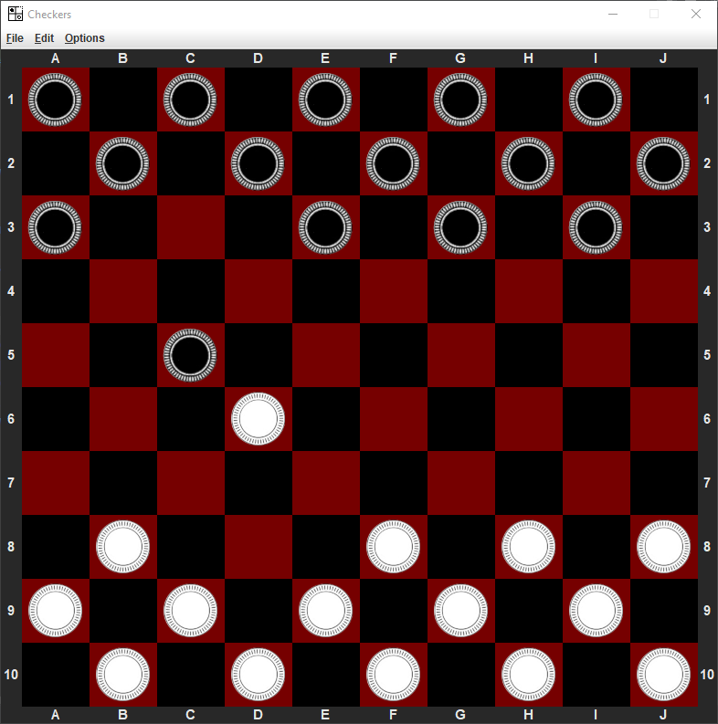 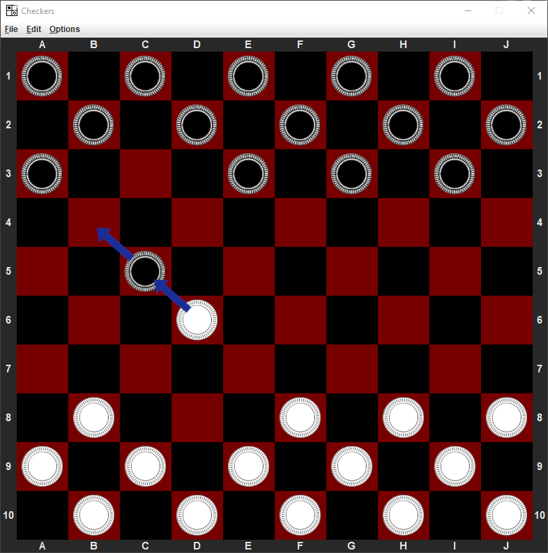 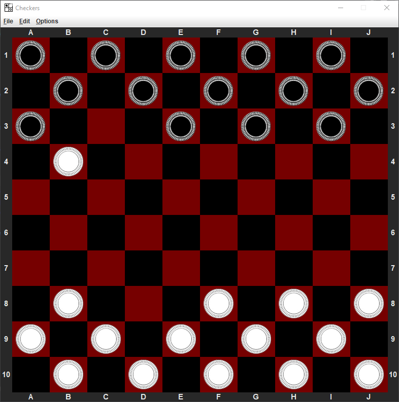
 

- Is there an opportunity to capture a next piece in the same play move, you have to until there is no more possible move:

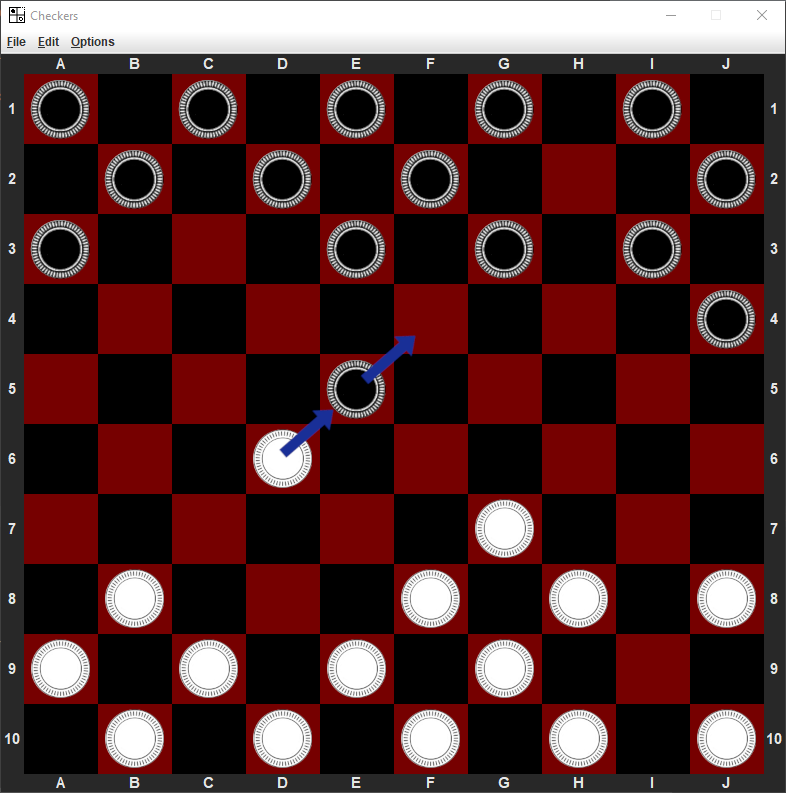 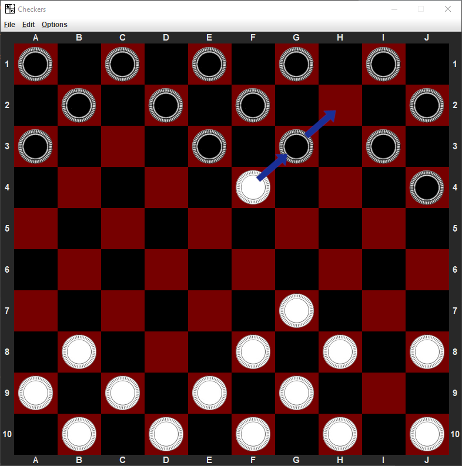 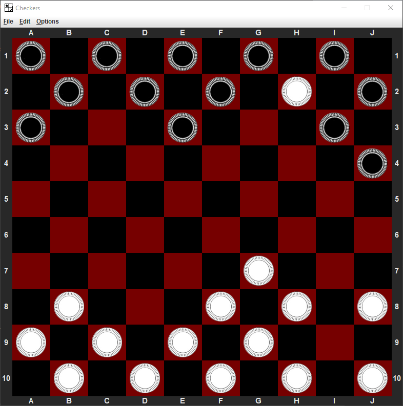
 

- A piece which is reaching the opposite side of the gameboard is turning into a queen
- The Queen can move in every diagonal direction and as many field as you want as long as the fields are empty 
- Is an enemys piece on a field and the field afterwards is emtpy as well, the queen can capture it over the whole distance of its move:

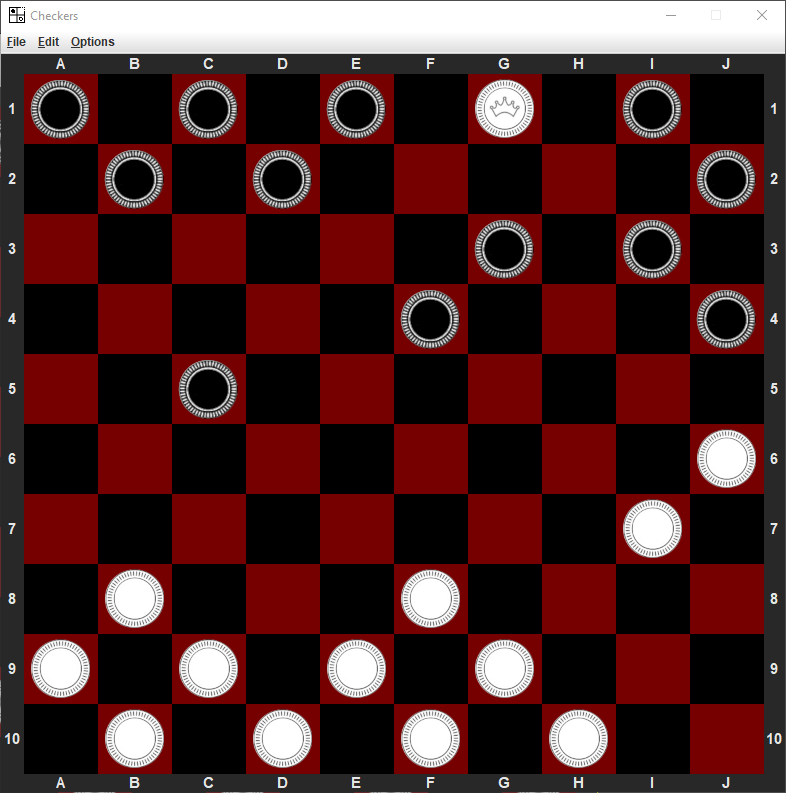 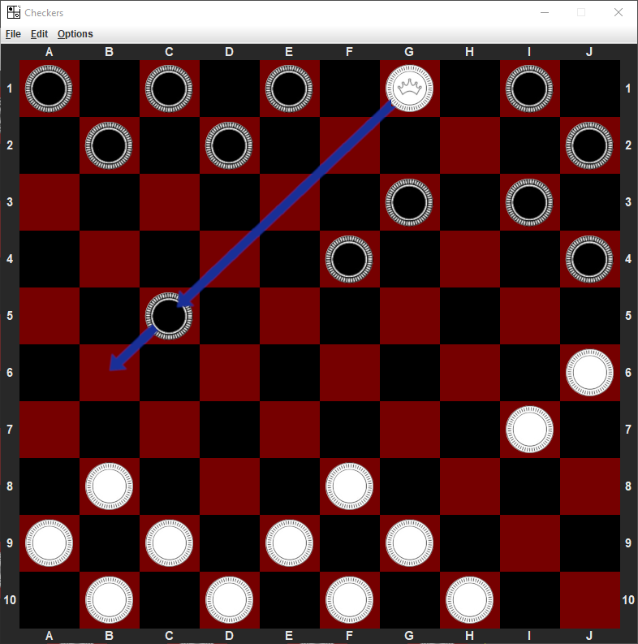 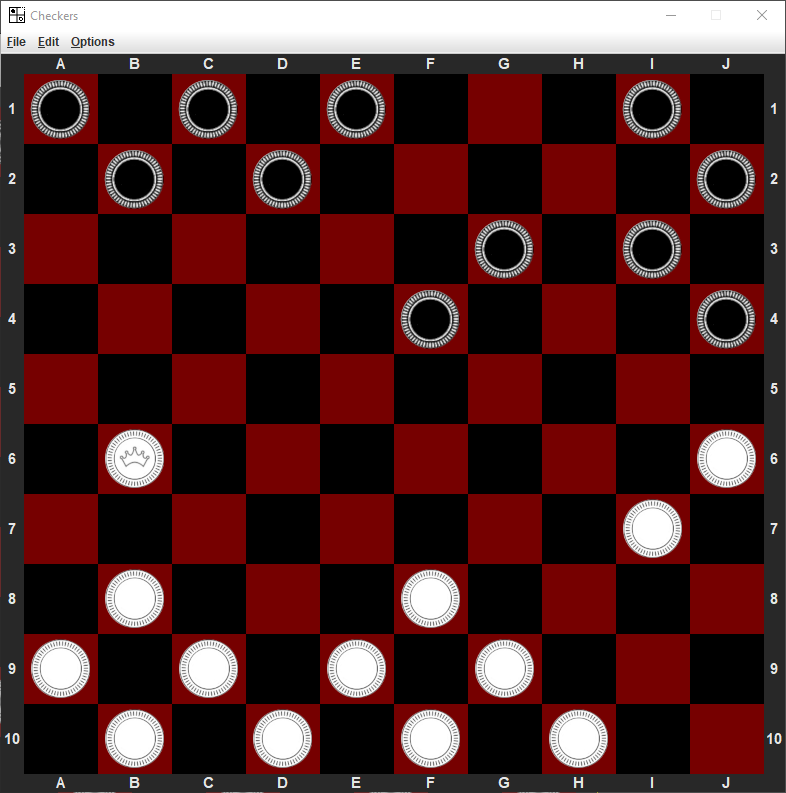
 

CONTROLLS:
-

There are 2 ways to make your moves:
- Typing your move into the terminal:
  - If you need help, 'help' is your way to go
  - 'new 8' or 'new 10' creates a new gameboard with your choosen size
  - 'move XX YY' moves a piece from a field to a new field: Example: move B8 C7
  - If you are not sure about a move, use 'try XX YY' to check if a move is legal
  - There are a few more other commands you can find out with 'help'
- Using your mouse to move your pieces:
  - Click on the piece you want to move, the field is going to be marked
  - Now click on the field you want to move your piece. If the move is illegal, the terminal will tell you! 
  - TIP!: Sometimes it needs a few clicks to initialize the move